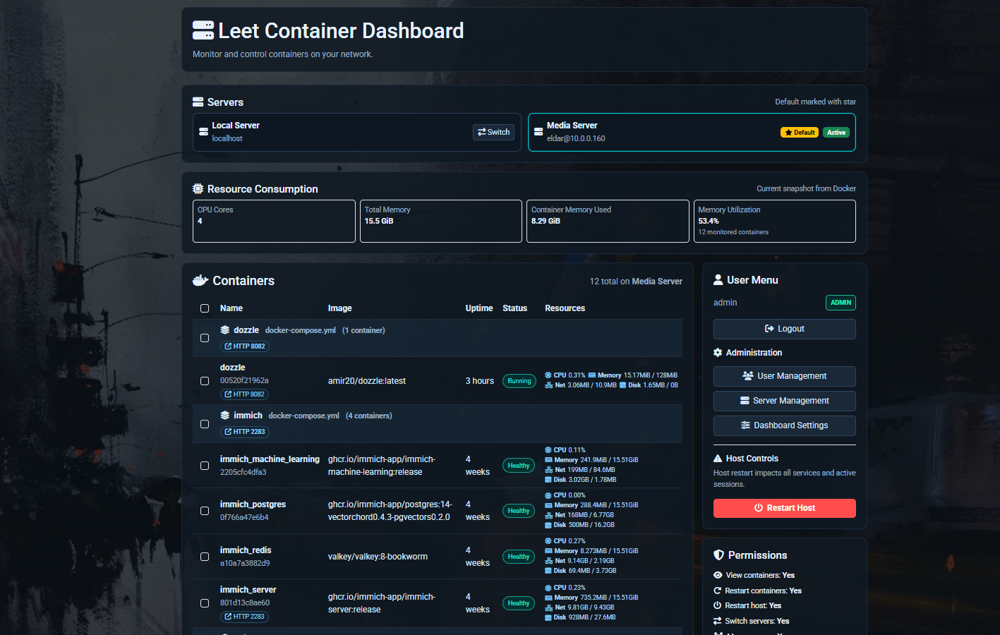

# Leet Container Dashboard

Leet Container Dashboard is a TypeScript + Bun web dashboard for managing Docker containers across local and remote servers.

## Screenshot



## Features

- Docker container monitoring and management (start, stop, restart, remove)
- Bulk container actions
- Local + remote server support with active/default server selection
- User authentication with role-based access control (RBAC)
- User administration (create, update, enable/disable, delete)
- Dashboard customization (theme, title/slogan, background image)
- Server and container resource metrics

## Tech Stack

- **Runtime:** Bun
- **Language:** TypeScript
- **Server:** Express
- **Views:** EJS
- **Auth & Security:** cookie-parser, bcryptjs, CSRF protection
- **Testing:** Vitest + Supertest

## Getting Started

### Prerequisites

- [Bun](https://bun.sh/) (If you want to develop)
- Docker (for container data/actions)

## Just Run: Run with Docker

If you want the most reproducible setup, use Docker Compose.

### Production-style run

```bash
docker compose up -d --build
```

### Development run (with `bun run dev`)

```bash
docker compose -f docker-compose.dev.yml up -d --build
```

Open `http://localhost:3000` after the container starts.

To stop:

```bash
docker compose down
docker compose -f docker-compose.dev.yml down
```

### Local Development: Install dependencies

```bash
bun install
```

### Configure environment

Copy `.env.example` to `.env` and adjust values if needed.

Key variables:

- `PORT=3000`
- `COOKIE_NAME=hsp_session`
- `COOKIE_SECRET=change-me`
- `REMOTE_SERVERS_KEY=`
- `COOKIE_SECURE=false`


Production note:

- You **must** set `COOKIE_SECRET` in production. If not set, the app creates an ephemeral value at startup, and every restart invalidates all existing login sessions.
- You **must** set `REMOTE_SERVERS_KEY` in production. If not set, the app creates an ephemeral encryption key at startup, and encrypted remote server passwords saved during that run cannot be decrypted after restart.

### Run in development

```bash
bun run dev
```

Then open `http://localhost:3000`.

### Run tests

```bash
bun run test
```

## Project Notes

- Built with a focus on home-lab operations and simple container workflows.
- Includes support for remote Docker hosts via server configuration in the UI.

## Credits

Created in **6 hours** by **Eldar Gerfanov** with **99% of Codex 5.3 and Cline VSCode extension**.

## License

This project is licensed under the **MIT License**.
