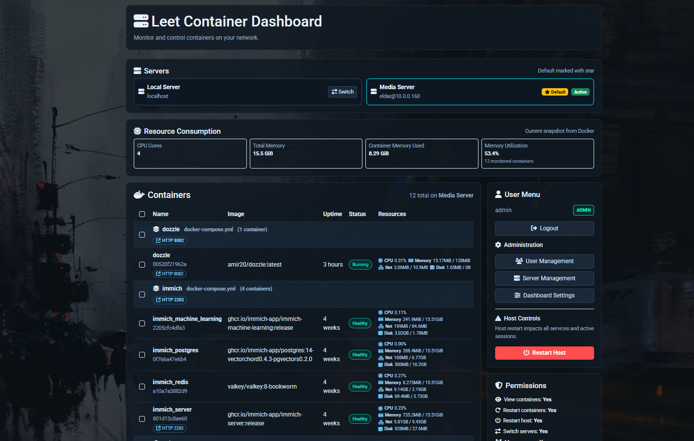

# Leet Container Dashboard

Leet Container Dashboard is a TypeScript + Bun web dashboard for managing Docker containers across local and remote servers.

## Demo
Try out the live demo at: **https://lcd.snapwebapps.com/**
**Login credentials:**
- **Admin:** Username: `test-admin`, Password: `testtest`
- **Operator:** Username: `test-operator`, Password: `testtest`
- **Viewer:** Username: `test`, Password: `testtest`

### Dashboard
- Docker container monitoring and management (start, stop, restart, remove)
- Bulk container actions
- Local + remote server support with active/default server selection
- Server and container resource metrics
- Dashboard customization (theme, title/slogan, background image)




### Launchpad

The launchpad automatically discovers containers with exposed HTTP/HTTPS ports across all your configured servers. Container information is synced automatically every 30 seconds in the background.


**Auto-Discovery Features:**
- Automatically detects containers with TCP ports
- Smart icon recognition for popular services (Plex, Jellyfin, Portainer, Nextcloud, etc.)
- Tracks service status (running, stopped, removed)
- Multi-server support with per-server service tracking

**Customization:**
All launcher tiles can be customized through the dashboard UI (future feature) or by editing `data/launchpad.json`:
- **Name** - Display name for the service
- **Public URL** - Override the local URL with a public domain
- **Icon** - Font Awesome icon class (e.g., `fa-solid fa-rocket`)
- **Icon Color** - Custom color class
- **Hidden** - Hide from launcher (still visible when "Show all" is enabled)

Services are automatically discovered on startup and kept in sync with your running containers.

## Other Features
- User authentication with role-based access control (RBAC)
- User administration (create, update, enable/disable, delete)

## Tech Stack

- **Runtime:** Bun
- **Language:** TypeScript
- **Server:** Express
- **Views:** EJS
- **Auth & Security:** cookie-parser, bcryptjs, CSRF protection
- **Testing:** Vitest + Supertest

## Getting Started

### Prerequisites

- Docker (for running the dockerized app)
- [Bun](https://bun.sh/) (If you want to develop or run natively)


## Quick Start: Docker Hub (Recommended)

The easiest way to get started is using the pre-built Docker image from Docker Hub:

### Using Docker Run

```bash
docker run -d \
  --name leet-container-dashboard \
  -p 3000:3000 \
  -v /var/run/docker.sock:/var/run/docker.sock \
  -v $(pwd)/data:/app/data \
  -e COOKIE_SECRET=your-long-random-secret-here \
  -e REMOTE_SERVERS_KEY=your-long-random-key-here \
  eldargerfanov/leet-container-dashboard:latest
```

### Using Docker Compose

Create a `docker-compose.yml` file:

```yaml
services:
  panel:
    image: eldargerfanov/leet-container-dashboard:latest
    ports:
      - "3000:3000"
    environment:
      - COOKIE_SECRET=change-this-to-a-long-random-string
      - REMOTE_SERVERS_KEY=change-this-to-a-long-random-string
    volumes:
      - ./data:/app/data
      - /var/run/docker.sock:/var/run/docker.sock
    restart: unless-stopped
```

Then run:

```bash
docker compose up -d
```

**First Run:** The container will automatically seed your data directory with default configuration files, dashboard settings, and a sample background image.

**Data Persistence:** All your settings, users, and uploads are stored in the mounted `./data` directory and will persist across container restarts.

Open `http://localhost:3000` after the container starts.

## Build from Source

If you want to build the image locally instead of using Docker Hub:

### Check out the source code
```bash
git clone https://github.com/swindex/Leet-Container-Dashboard
```

### Build in Docker (with `bun run dev`)

```bash
docker compose -f docker-compose.dev.yml up -d --build
```

Open `http://localhost:3000` after the container starts.

To stop:

```bash
docker compose down
docker compose -f docker-compose.dev.yml down
```

### Local Development: Install dependencies

```bash
bun install
```

### Configure environment

Copy `.env.example` to `.env` and adjust values if needed.

Production note:

- You **must** set `COOKIE_SECRET` in production. If not set, the app creates an ephemeral value at startup, and every restart invalidates all existing login sessions.
- You **must** set `REMOTE_SERVERS_KEY` in production. If not set, the app creates an ephemeral encryption key at startup, and encrypted remote server passwords saved during that run cannot be decrypted after restart.

### Run in development

```bash
bun run dev
```

Then open `http://localhost:3000`.

### Run tests

```bash
bun run test
```

## Project Notes

- Built with a focus on home-lab operations and simple container workflows.
- Includes support for remote Docker hosts via server configuration in the UI.

## Credits

Created by **Eldar Gerfanov** with help of Codex 5.3, Sonnet 4.5 and Cline VSCode extension.

## License

This project is licensed under the **MIT License**.
